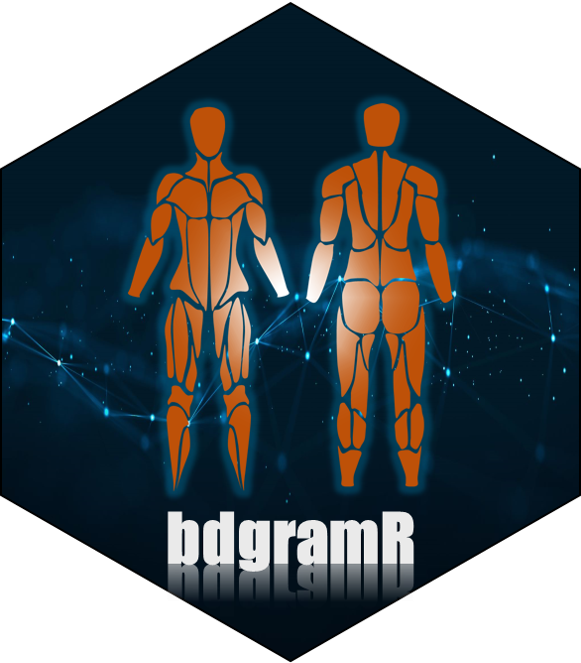

 <!-- badges: start -->
  [](https://opensource.org/licenses/MIT)
  [](https://www.tidyverse.org/lifecycle/#experimental)
  <!-- badges: end -->


# {bodygramR}
A collection of body diagram visualizations in R



  
  
***
  
  
### 1) What is {bodygramR}?

An R package that provides raw **x,y** coordinates to draw human body diagrams in R. This type of visualizations are commonly used in Sport Science, Strength and Conditioning and other health related areas to report visual information about muscle / joint related metrics such as muscle soreness, muscle activation, strength, temperature, etc...

For more information on how body diagrams can be used in R please visit [this article](https://rpubs.com/Josedv82/body_diagrams_R) and this [github repo](https://github.com/josedv82/body_avatars_in_R) where I wrote about some ideas to add visualizations to reports and integrate with other packages for more functionality.

### 2) Installation

```
#Install from CRAN 
#Not currently on CRAN

  
#Install the development version from GitHub  
install.packages("devtools")
devtools::install_github("josedv82/bodygramR")
```

### 3) Usage

{bodygramR} is a small package and provides only a handful on functions:

##### Get a list of all the *bodygrams* types available with `model_types()`


```{r}
library(bodygramR)

model_types(data = data)

# A tibble: 9 x 1
  Model             
  <fct>             
1 futuristic_male   
2 original_male     
3 original_female   
4 thermohuman_male  
5 thermohuman_female
6 athletesr         
7 basic_female      
8 basic_male        
9 multi_view_male  

```

##### Use `glimpse_models()` to visualy explore what each *bodygram* looks like.

```{r}
library(bodygramR)

glimpse_models(data = data, color = "brown", fill = "orange")

```


#### Get raw x/y coordinates of the *bodygram* you wish to use with `bodygram()`

```{r}
library(bodygramR)

dat <- bodygram(data = data, model = "original_male")

head(dat)

 Id      View       Part  Group Muscle  Side   x   y
1  1 Posterior Lower_Body Calves Soleus Right 739 723
2  1  Anterior Lower_Body Calves Soleus Right 739 724
3  1  Anterior Lower_Body Calves Soleus Right 740 724
4  1  Anterior Lower_Body Calves Soleus Right 740 725
5  1  Anterior Lower_Body Calves Soleus Right 741 725
6  1  Anterior Lower_Body Calves Soleus Right 741 726
```

#### Finally, you can use `geom_bodygram()` within your ggplot code.

```{r}

library(bodygramR)
library(ggplot2)

dat <- bodygram(data = data, model = "original_male")

ggplot(data = dat, aes(x,y, group = Id)) +
  geom_bodygram()

```


Like with any other ggplot, users can add more layers to further customise the visualization. For example:

```{r}
library(bodygramR)
library(ggplot2)

dat <- bodygram(data = data, model = "original_male")

plot <- ggplot(data = dat, aes(x,y, group = Id)) +
  geom_bodygram(color = "cyan", aes(fill = Muscle)) +
  ggtitle("BodygramR: original_male diagram")
  
plot

```


### 4) Acknowledgment

I'd like to credit two known sources of inspiration for some of the availabel body diagrams in this package.

Two of the available *bodygrams* are inspired on [athleteSR](https://www.athletesr.com/) and [Thermohuman](https://thermohuman.com/) as  the body diagrams they use on their software are very well designed. In this case, I have named the *bodygrams* after the actual software.

### 5) Future Development

{bodygramR} is a small package and likely not much more development needed besides adding some more *bodygram* types. However, the package is currently under development and I welcome any feedback to improve or issues you may come across when using it.

